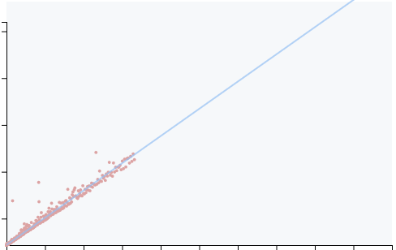
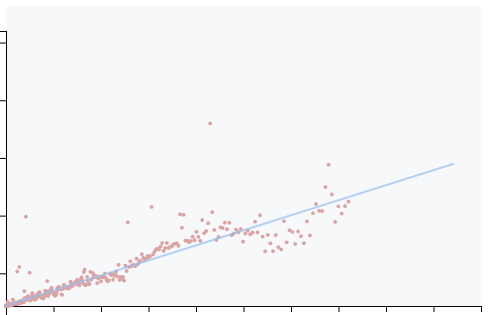

The MirageOS project is aware about security issues. This goal is strong when,
at the beginning, the idea of a small *unikernel* can ensure (by intuition) a
small attack surface. By this way, we want to follow as possible as we can
improvements into security stacks such as TLS.

Of course, we are not a huge team and some of us don't have a strong knowledge
about security. This topic is highly complex and it's easy to think that we are
secure - and, by facts, we are not. However, it gives to us an opportunity to
learn and improve what we can find about this topic and go on our way to try to
provide the best as we can.

This article wants to show a little project which wants to solve a security
issue, the timing attack. We will see what we did on this purpose to be able to
improve [mirage-crypto][mirage-crypto].

## A timing attack!

It's clearly not an usual attack for me and I did not (yet!) understand in
which way it's possible to use this side-channel attack over a complex
black-box such as an SMTP service. However, the first lesson about security is
to agree with the fact that when you can imagine this attack (even if, by your
technical means, it's not possible), someone else into our world has the
ability to use this attack.

The point is not to try to think how this kind of attack is possible but to
assert that this attack **is** possible.

The timing attack is in this case where we use the time to try to introspect
data such as a password. The idea is simple, we can take this simple `equal`
function:

```ocaml
let equal s1 s2 =
  let res = ref true in
  let idx = ref 0 in
  if String.length s1 <> String.length s2
  then false
  else
    ( while !idx < String.length s1 && !res
      do res := s1.[!idx] = s2.[!idx] ; incr idx done ; !res )
```

If we are in the case where we want to compare the given password by the user
and the password stored into our database (or their hashes), we will use this
function - and allow the user to enter into a *secured* area.

However, we can see that the time spent by `equal` depends on given inputs `s1`
and `s2`.

### The worst case.

Imagine that the atomic operation `s1.[!idx]` (or `s2.[!idx]`) spend 1 second
(like 1 *CPU tick*). So, for each iteration into our loop, we will spend 2
seconds *while `!res` still is `true`*. That means when we meet 2 different
bytes, we leave the loop<sup>[1](#fn1)</sup>.

Now, imagine we have these values:

```ocaml
equal "aabb" "aaaa" ;;
```

We can easily infer that this function will spend 6 seconds (2 seconds for
first characters, 2 seconds for second characters, 2 seconds for third
characters and we leave the loop). And about equal values such as:

```ocaml
equal "toto" "toto" ;;
```

We will spend 8 seconds (and return `true`). The time needed to compute the
`equal` function depends on given inputs. By this way, if we observe time
needed to be authenticated from a *login* page, we can infer values given into
the `equal` function.

Finally, from that fact, imagine that `s1` is the given password by us and `s2`
is the password stored into our database, we can infer just with the time if we
are close to be equal to the password stored into our database.

<tag id="fn1">**1**</tag>: In C, the case appears when we `return false`
directly which is a jump and leaves the loop as we do in OCaml.

### A smart brute-force attack.

So now we can imagine a tool which will try all possibilities. It will record
times spent for each random inputs. Then, when it appears that from an input
`t0`, time spent differs (is lower than) from an input `t1`, we can imply that
our `equal` function go a bit further when it scanned our input `t1` (than
`t0`).

By this fact, we can imply that `t1` is more close to the expected password
than `t0` and we can redo the same operation but with a new base `t1` - and by
this way, discard all others next (and useless) possibilities with `t0` as a
base.

Eq(af) gives to you an example of this attack. Of course, we plugged into our
operations an `Unix.sleep` to be able to see a real difference when we call our
`equal` function. Finally, the result is pretty good:

```sh
$ dune exec attack/attack.exe
Random: [|253;164;168;66;47;219;88;152;128;242;216;123;|].
7c8ceadc51d33cadc97cce73fc7c86a1
7c8ceadc51d33cadc97cce73fc7c86a1
```

The second line is the expected hash, the third line is the hash found only by
an introspection of the time. The first line is the seed given by the random to
be able to replicate the result. This tool does not work all the time!

## Too deep to be dangerous?

Of course, into the real world, our `equal` function is much much much more
fast than some seconds. However, even if it can be hard to track how long
`equal` spend, it's not impossible. I mean, it's a bit hard but a way exists to
know how long any function spend.

This way is the *micro*-benchmark! Of course, when you want to compare speed of
your functions, you introspect time! So if we can do that usually to check
which function is faster than the other, we can apply the idea of the benchmark
on two call of the same `equal` function but with different inputs.

### Eq(af) does the test for you

So, our distribution comes with a little benchmark tool which wants to see how
long `equal` spend when we give to it 2 different values and 2 equal values.
Then, we *extrapolate* results.

We *run* this function 1 time, 2 times, 3 times, ... to 3000 times and we
record times for each run. From that, we are able to plot a curve. So about
expected results:

- If our curve is a line, that means for each *run*, we spend the same time
  whatever inputs.



- If our curves is not exactly a line, that means time spent depends on inputs



So from this curve, we apply a *linear-regression* to see if it's a line or
not. From that, we can get a ~R²~ which is a regression coefficient and it
tells to us if it's a *true* line (where `R² >= 0.99`) or not.

As you can see, we have some noises (some points are not strictly aligned) -
it's because the inherent volatility when we want to record the time. It's why
we need to apply a *linear-regression* to delete as much as possible this
noise. An other factor about that is the context where you execute your
function, the scheduler can decide to stop our `equal` function and do
something else (but our `equal` function still spends his time). Finally, it
still is hard to track the time.

## How to fix it?

The easiest way to avoid this side-channel attack is to spend exactly the same
time for any inputs. At the end, even if we encounter different bytes, we will
continue to scan inputs.

```ocaml
let equal s1 s2 =
  if String.length s1 <> String.length s2 then false
  else
    ( let res = ref true in
      for idx = 0 to String.length s1 - 1
      do res := s1.[idx] = s2.[idx] && !res done ;
      !res )
```

### Into the OCaml side!

However, into the OCaml world, the deal can be much more complex that what we
can imagine. Even if it's *easy* to translate an OCaml code to an assembly
code, the compiler can emit some *jump* and produce a *non constant-time* (or
a non *branch-less*) function at the end.

In our example, the only idea to use `None` and `Some` instead `false` and
`true` into our code implies a call to the garbage collector - and a *jump* in
the emitted assembly. This case appear when we want to implement `compare` and
keep somewhere (into our `int option`) the subtraction of different bytes while
the loop.

Into Eq(af), we did a huge introspection about the assembly generated to ensure
that we don't have any *jump* and any assembly instructions will be executed
regardless inputs - and only from that we can say that our function is
*constant-time*<sup>[2](#fn2)</sup>.

<tag id="fn2">**2**</tag>: *constant-time* is not a good word where it can have
an other signification when we talk about complexity and algorithm. And it's
not really true when the time still depends on the length of the given input.

## Conclusion

Eq(af) provides a quite easy function and anybody can re-implement it. But it
comes with tools which want to check our assumption, the time spent can not
leak any information. Or course, as we showed, it can be hard to check that.

We have different tools to check/prove that where, at this time, we only do a
check but we can go further by an introspection of the emitted code by an other
tool to see if are surely *branch-less*.

At the end, Eq(af) is used by some people who are aware about security issues
and it's why we decided to use it as a default into [digestif][digestif] to
protect any users from this side-channel attack.

[mirage-crypto]: https://github.com/mirage/mirage-crypto/
[digestif]: https://github.com/mirage/digestif/
